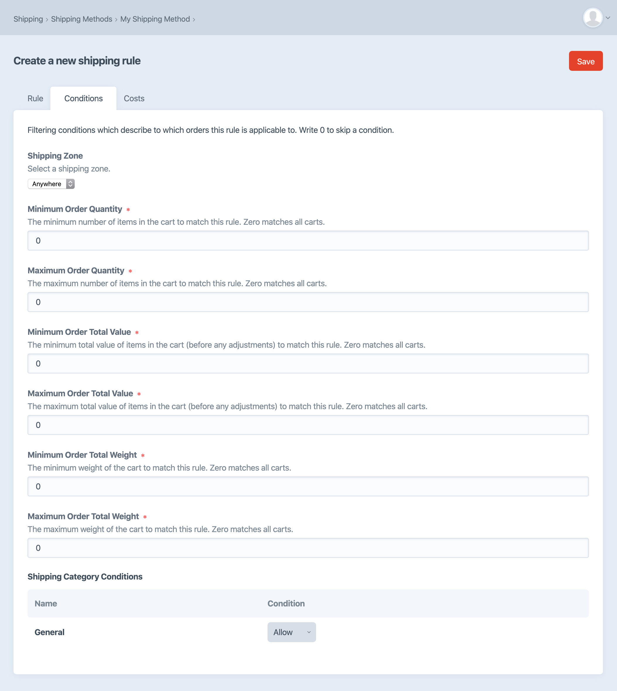
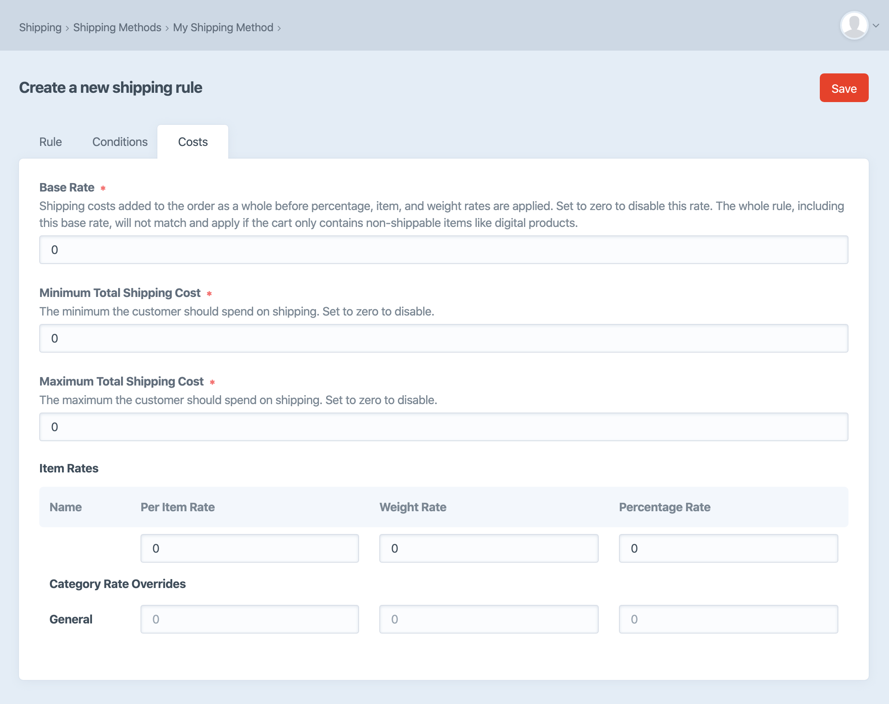

# Shipping

The shipping system in Craft Commerce faciliates adding shipping costs to the cart.

::: warning
Shipping features differ depending on your [edition](editions.md) of Craft Commerce.
:::

In the Lite edition of Craft Commerce only two fixed shipping costs can be configured:

1. A single fixed per-order shipping cost
2. A per-item fixed shipping cost

These shipping cost settings can be updated in Commerce → Settings → General, and show up on every order made when running the Lite edition of Craft Commerce. You can set these to zero if no shipping costs need to be added to the order.

In the Pro edition of Commerce, complex shipping rules including categories, zones and rules are available. The core components of the shipping system are:

- Shipping categories
- Shipping zones
- Shipping methods and rules

Shipping methods and rules are at the core of the shipping engine in the Pro edition of Craft Commerce. The shipping rules use shipping categories, shipping zones, and additional order conditions to determine which shipping methods are available to the cart for customer selection.

## Shipping Categories

Shipping categories are a way to identify different types of products to the shipping system.

When defining a product type, you can see the shipping categories products of that type can belong to. When setting up individual products, an author can choose which of the available shipping categories that product belongs to.

When setting up a shipping category, you can select which product types are available to it.

While setting up shipping rules, you have the ability to include those shipping categories into the rule’s conditions and costs.

For example, you might set up a shipping rule that’s unavailable if the cart contains a product in a specific shipping category. You might have another shipping rule that returns special prices for different categories of products in the cart.

## Shipping Zones

Shipping zones are areas you ship to. Shipping zones can be made up of one or more countries, and (optionally) further specify one or more states within those countries. They can also provide a zip code condition formula.

For example, you might make one zone for the USA and Canada, and another zone for the international countries you ship to.

These zones can then be used within the shipping rules as conditions to match on the customer’s shipping address.

Tax Zones are either country-based, matching the shipping address to the list of countries in the zone, or state-based, matching the shipping address to the list of states in the zone. In addition to country and state matching, an address can match a zip code condition formula.

### Zip code condition formula

A zip code condition formula is an expression written in [Twig’s expression syntax](https://twig.symfony.com/doc/2.x/templates.html#expressions) that returns `true` or `false`.

This will match if the zip code’s first two characters are `60` or `70`:

```
zipCode[0:2] == '60' or zipCode[0:2] == '70'
```

The will match if the zip code is equal to `NG102`, `ZZ200`, or `CC101`:

```
zipCode in ['NG102', 'ZZ200', 'CC101']
```

## Shipping Methods

Shipping methods are the choices available to the customer during checkout. For example, a shipping method might be called “Pickup”, “FedEx”, “USPS”, or “Express”.

You can name these shipping methods anything that makes sense to the customer. They don’t need to be shipping company names, but usually indicate the delivery method. For example, you could have two shipping methods, one called “FedEx Standard” and “FedEx Overnight”.

Shipping methods contain a collection of shipping rules, which are conditions for determining when the shipping method should be available.

::: warning
If a customer changes their shipping address during checkout, a previously selected shipping method may no longer match and will be immediately removed as the shipping method set on the cart.
:::

## Shipping Rules

Shipping rules belong to a shipping method and may be edited in that shipping method’s “Rules” tab after it’s first saved. Each rule is checked one by one, in order, against the cart to see if it’s a match. The first rule that matches the cart supplies the pricing to the shipping method. If no rules match the cart, that shipping method is not available for the customer to select.

## Shipping Rule Conditions

The matching of the shipping rules to the cart is based on the following rules conditions:



### Shipping Zone

Each shipping rule can have a single zone. This condition is met if the order’s shipping address falls within this zone.

### Minimum Order Quantity

This condition is met if the order has at least a certain number of items.

### Maximum Order Quantity

This condition is met if the order quantity does not exceed a certain number of items.

### Minimum Order Total Price

This condition is met if the total order price is at least a certain amount.

### Maximum Order Total Price

This condition is met if the total order price is no more than a certain amount.

### Minimum Order Total Weight

This condition is met if the total order weight is at least a certain amount.

### Maximum Order Total Weight

This condition is met if the total order weight is no more than a certain amount.

### Shipping Categories

The shipping rule has options for each category in the system. Each shipping category can be set to:

1. **Allow**: products can be allowed for this shipping method.
2. **Disallow**: if products are found in the cart the rule will not match the cart.
3. **Require**: products must exist in the cart for this rule to match.

This rule can allow, disallow, or require certain products to match this rule.

## Shipping Rule Costs



### Base Rate

Set a base shipping rate for the order as a whole. This is a shipping cost added to the order as a whole and not to a single line item.

### Minimum Total Shipping Cost

The minimum the person should spend on shipping.

### Maximum Total Shipping Cost

The maximum the person should spend on shipping after adding up the base rate plus all item-level rates.

### Item Rates

#### Per Item Rate

Set a default per-order item shipping rate.

#### Weight Rate

Default cost per whole unit of the store’s dimension units. For example, if you set your dimension unit option to Kilograms, your product weight is 1.4Kg, and you enter `1` as the “Weight Rate”, then the price will be \$1.40.

#### Percentage Rate

The default amount based on a percentage of item’s cost.

#### Category Rate Overrides

You can further customize the Per Item, Weight, and Percentage rates in each category.
